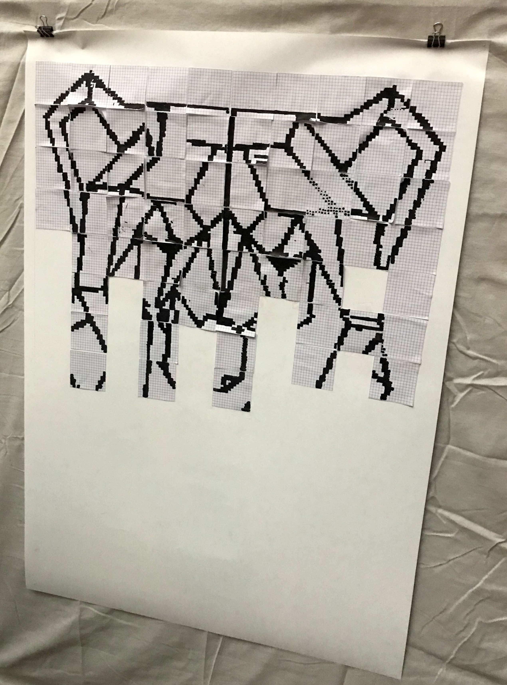

Ce répertoire contient du code python pour générer des pdfs qui 
correspondent à des exercices de décodage.
Un grande image est découpée en tuiles qui sont codées en run-length.
La convention consiste à commencer par mentionner le nombre de blanc, suivi du nombre de noirs, etc... pour chaque ligne.
Une fiche d'explications est fournie dans le [répertoire](../codages-run-lengths).

Cette activité a été testée à la Fête de la Science 2018.
Le fichier mosaique.py contient les sources python.
Les pdfs contiennent les codes et les solutions.
Le fichier quadrillage.pdf fournit des quadrillages en plus en cas d'erreur.

